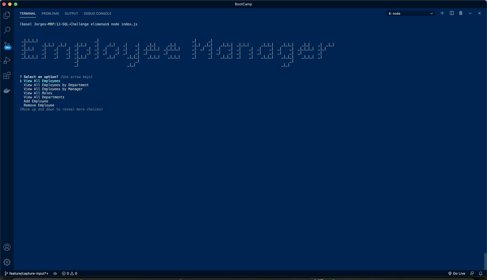
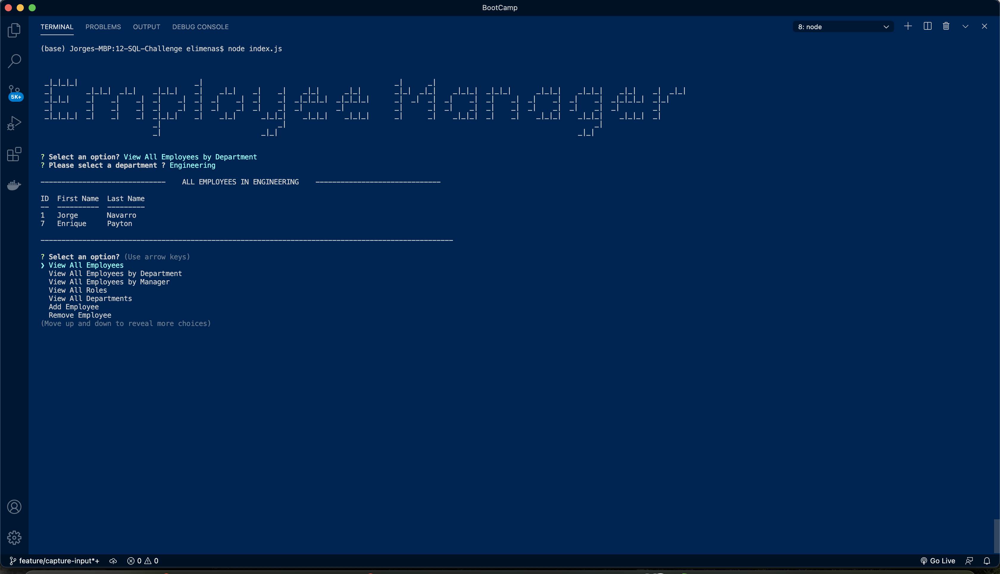
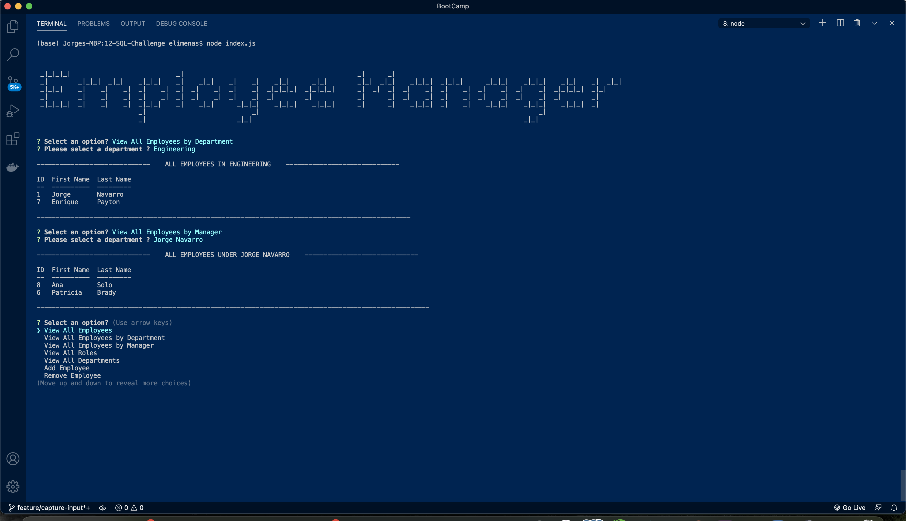

# 12-SQL-Challenge
Employee Tracker

## Table of Contents

* [Description](#Description)
* [Requirements](#Requirements)
* [Installation](#Installation)
* [Usage](#Usage)
* [License](#License)
* [Badges](#Badges)
* [Issues](#Issues)
* [Technologies](#Technologies)
* [Screenshot](#screenshot)
* [Walkthrough-Video](#walkthrough-video)
* [Deployment](#deployment)
* [Contributing](#Contributing)
</br>
</br>

## Description
A command-line application to manage a company's employee database, using Node.js, Inquirer, and MySQL.
<br>
<br>

## Requirements
#### User Story
>AS A business owner, I WANT to be able to view and manage the departments, roles, and employees in my company. SO THAT I can organize and plan my business
<br>

>GIVEN a command-line application that accepts user input
<br>

>WHEN I start the application.<br>
>>THEN I am presented with the following options: view all departments, view all roles, view all employees, add a department, add a role, add an employee, and update an employee role.<br>

>WHEN I choose to view all departments.<br>
>>THEN I am presented with a formatted table showing department names and department ids<br>

>WHEN I choose to view all roles.<br>
>>THEN I am presented with the job title, role id, the department that role belongs to, and the salary for that role<br>

>WHEN I choose to view all employees<br>
>>THEN I am presented with a formatted table showing employee data, including employee ids, first names, last names, job titles, departments, salaries, and managers that the employees report to<br>

>WHEN I choose to add a department<br>
>>THEN I am prompted to enter the name of the department and that department is added to the database<br>

>WHEN I choose to add a role<br>
>>THEN I am prompted to enter the name, salary, and department for the role and that role is added to the databas<ebr>

>WHEN I choose to add an employee<br>
>>THEN I am prompted to enter the employee’s first name, last name, role, and manager and that employee is added to the database<br>

>WHEN I choose to update an employee role<br>
>>THEN I am prompted to select an employee to update and their new role and this information is updated in the database<br>

<br>
<br>

## Installation
To use this application, please install: 
```
npm install
npm install mysql2
npm install inquirer
npm install console.table
npm install figlet
```

<br/>
<br/>

## Usage
After cloning the repo and installing the required npm packages, use the command line to navigate to the root of the application and run node index.js .
<br/>
<br/>

## License 
[](https://opensource.org/licenses/MIT)
</br>
</br>

## Badges


</br>
</br>

## Issues
[](https://GitHub.com/jorgeebn16/12-SQL-Challenge/issues/)
[](https://GitHub.com/jorgeebn16/12-SQL-Challenge/issues?q=is%3Aissue+is%3Aclosed)
</br>
</br>

## Technologies
* [Javascript](https://developer.mozilla.org/en-US/docs/Web/JavaScript)
* [jQuery](https://jquery.com/)
* [npm](https://www.npmjs.com/)
* [mysql2](https://www.npmjs.com/package/mysql2)
* [inquirer.js](https://www.npmjs.com/package/inquirer)
* [console.table](https://www.npmjs.com/package/console.table)
* [figlet](https://www.npmjs.com/package/figlet)
<br/>
<br/>

## Screenshot



</br>
</br>

## Walkthrough Video
View the [Walkthrough video here.](https://drive.google.com/file/d/1pDzPvuhKgv-fJAQAgfGVRf3FFhiiT3uV/view)
</br>
</br>

## Deployment
View[Github repository URL](https://github.com/jorgeebn16/12-SQL-Challenge)

## Contributing
[](https://GitHub.com/Naereen/jorgeebn16/12-SQL-Challenge/graphs/contributors/)

For anyone who wishes to contribute you can contact me with at jorgeebn16@gmail.com
</br>
</br>

Would you like to reach me?
</br>
Contact Me:

Github: https://github.com/jorgeebn16
Email: jorgeebn16@gmail.com


## Issues
[](https://GitHub.com/jorgeebn16/12-SQL-Challenge/issues/)
[](https://GitHub.com/jorgeebn16/12-SQL-Challenge/issues?q=is%3Aissue+is%3Aclosed)


